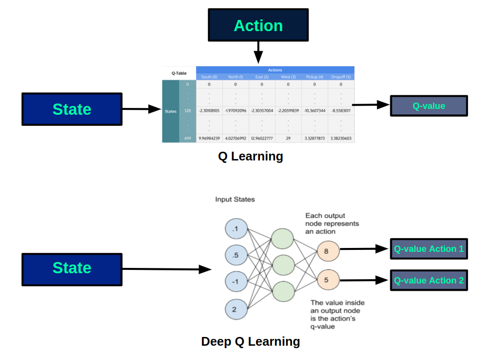

# Q-learning
Q-learning es una técnica de RL, el objetivo del Q-learning es aprender una serie de normas que le diga a un agente qué acción tomar bajo qué circunstancias. Para cualquier proceso de decisión de Markov finito (PDMF) (finite Markov decision process en inglés), Q-learning encuentra una política óptima en el sentido de que maximiza el valor esperado de la recompensa total sobre todos los pasos sucesivos, empezando desde el estado actual. Q-learning puede identificar una política de acción-selección óptima para cualquier PDMF, dado un tiempo de exploración infinito y una norma parcialmente aleatoria,​ "Q" nombra la función que devuelve la recompensa que proporciona la acción y representa la "calidad" de una acción tomada en un estado dado.
​El peso de un paso en un estado $\Delta t$ pasos en el futuro se calcula como $\gamma^{\Delta t}$ siendo $0\ge\gamma\ge1$ el factor de descuento y el que evalúa las recompensas recibidas anteriormente con un valor mayor que las recibidas posteriormente (reflejando el valor de un "buen inicio"). $\gamma$ también puede ser interpretada como la probabilidad de tener éxito (o sobrevivir) en cada paso $\Delta t$. El algoritmo, por tanto, tiene una función $Q$ (de ah[i el nombre del algoritmo) que calcula la calidad de una combinación estado-acción: $Q:S \times A \rightarrow R$ , donde $S$ es el conjunto de estados, $A$ el de acciones y $R$ los reales.
Después, en cada tiempo $t$ el agente selecciona una acción $a_t$, observa una recompensa $r_t$, introduce un estado nuevo s_{t+1} (Que depende del estado anterior $s_t$ y de la acción seleccionada), y $Q$ se actualiza. El núcleo del algoritmo es una actualización del valor de la iteración simple, haciendo la media ponderada del valor antiguo y la información nueva:

$Q^{new}(s_t,a_t)=(1-\alpha) \cdot Q(s_t,a_t)+\alpha \cdot (r_t+\gamma \cdot {max_a Q(s_{t+1},a)})$

donde $r_t$ es la recompensa recibida al pasar del estado $s_t$ al estado $s_{t+1}$ y $0\ge\alpha\ge1$ es el índice de aprendizaje. Un episodio del algoritmo termina cuando el estado $s_{t+1}$ es un estado final o terminal. Aun así, Q-learning también puede aprender en tareas sin episodios. 
Q-learning simplemente guarda información en tablas pero esta aproximación flaquea con números crecientes de acciones/estados así entonces es que se decide usar Q-learning profundo.

# Q-learning profundo

La idea detrás del Q-learning profundo es reemplazar la tabla de $Q$ por una red neuronal profunda que aproxime a $Q$, las siguientes imágenes muestran gráficamente la diferencia. 

