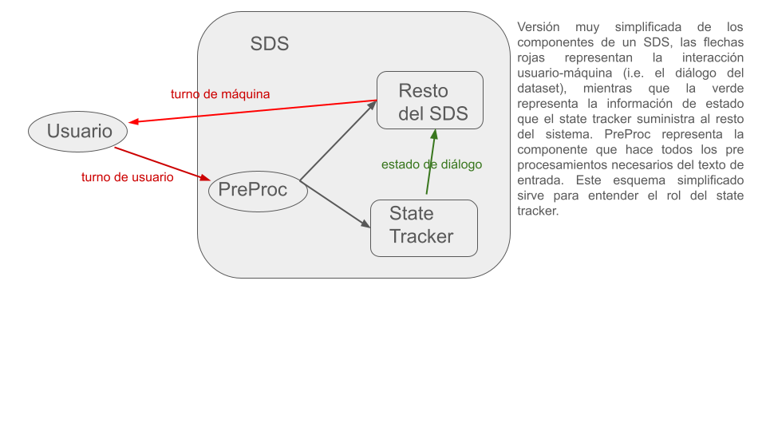
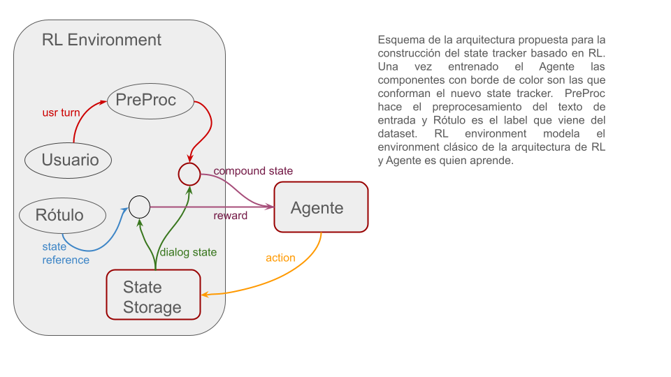

# Intro...
Los Spoken Dialogue Systems (SDS), o sistemas de diálogo en castellano, permiten a los usuarios interactuar con aplicaciones de computadora a traves de conversaciones. Los sistemas de ayuda basados en tareas ayudan a alcanzar las metas tales como obtener plazas de comida o reservar servicios tales como taxis o vuelos. El seguimiento del estado del diálogo o Dialogue State Tracking en inglés (DST) es un componente clave de un SDS que sirve para interpretar una entrada del usuario y actualizar si hace falta la creencia del estado del diálogo i.e. su intención, en cada turno del mismo. Es decir que el state tracker implementa la representación interna del sistema del estado de la conversación (Young et al., 2010). Esta información es usada por el manejador de diálogos para decidir que acción debería tomar el sistema.
En este trabajo se analiza la posibilidad de construir un state tracker utilizando RL clásico y RL con inspiración biológica. Se buscó un conjunto de datos rotulados acorde a esta problemática y se pensaron posibles experimentos bajo la asunción de que es posible tal construcción y se estudiaron métricas y baselines para comparar resultados.
En lo que sigue se describen cada una de las componentes del trabajo y se presentan discusiones al respecto. Para mejorar la organización tanto en la lectura como en el mantenimiento se profundizan dichos componentes en documentos separados.

# Dataset
Esta componente describe el dataset seleccionado para trabajar, el cual establece también el problema a resolver. Luego de analizar varios candidatos se eligió [Multiwoz](....) ya que es bastante usado en el ámbito de state tracking y se encuentran métricas y baselines para poder comparar. Está basado en diálogos (en inglés) usuario-máquina orientado a tareas. Plantea un escenario multi dominio (Restaurant, Attraction, Hotel, Taxi, Train, Bus, Hospital, Police) con los servicios de búsqueda o reserva (en algunos de ellos). Sobre este dataset es que se estudiará la construcción de un state tracker definiendo así el problema a resolver como se dijo con anterioridad. Los diálogos se encuentran rotulados (en cada turno) con el estado que necesita mantener el state tracker, dependiendo de la intensión del usuario y de las características de su intensión (llamadas slot) o sea por ejemplo el usuario podría estar buscando información (intensión) acerca del hotel "America" y en este caso el estado que mantiene el state tracker debería mantener alguna especie de representación que defina para el domino "Hotel" el slot "name" debe tener el valor "America" y que la intensión es la de busqueda de información (a diferencia de la intensión de reserva por ejemplo). 
Para profundizar en sus características ver [datase seleccionado](https://github.com/afiuriG/textMining/blob/main/datset.md)

# El problema
El primer paso en el establecimiento del problema es entender el funcionamiento de un SDS. En la siguiente figura vemos un esquema muy simplificdo de las componenetes sobre las que haremos foco.  

El dataset seleccionado nos provee la interacción entre usuario y máquina (las flechas rojas del esquema anterior en forma de diálogo) pero rotulado con los estados tras cada turno de usuario (la flecha verde). La idea de este trabajo es valernos de dichos datos para construir un state tracker que aprenda de los datos suministrados pero con técnicas de RL (usualmente se usan grandes redes profundas, mecanismos de atención, etc).

# Métodos

# Implementación

# Métricas y Benchmarks

#  Referencias......

