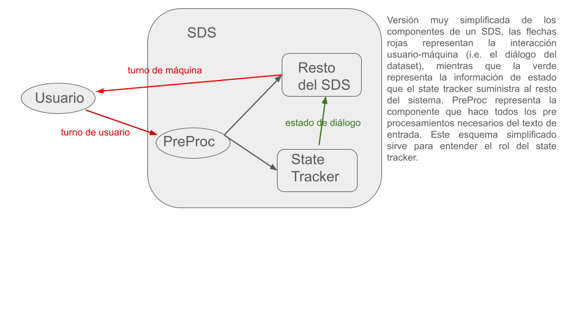

El primer paso en el establecimiento del problema es entender el funcionamiento de un SDS. En la siguiente figura vemos un esquema muy simplificdo de las componenetes sobre las que haremos foco.  

El dataset seleccionado nos provee la interacción entre usuario y máquina (las flechas rojas del esquema anterior en forma de diálogo) pero rotulado con los estados tras cada turno de usuario (la flecha verde). La idea de este trabajo es valernos de dichos datos para construir un state tracker que aprenda de los datos suministrados pero con técnicas de RL (usualmente se usan grandes redes profundas, mecanismos de atención, etc). En este sentido se hace necesario pensar el problema desde la óptica de RL. Será imprescindible entonces identificar la arquitectura desde este punto de vista, conceptos tales como environment, estado, reward tienen que ser claramente establecidos. La siguiente figura apunta a hechar luz en esa dirección.  

En la figura vemos que hay un componente llamado Agente, que representa el aprendiz de RL, vemos también que el Environment tiene varios componentes entre los que se encuentran Usuario y Rótulo que son las interfaces con el dataset que extraen los textos de los turnos de usuario y el rótulo del turno extraido respectivamente, PreProc al igual que antes es el preprocesamiento del texto del turno,State Storage representa una componente que guarda los estados encontrados hasta el momento y se ven dos componenetes especiales sin nombre en la imagen cuya misión es la de calcular un reward y componer un estado del environment para el agente. El reward será calculado en función del estado almacenado para ese turno y del rótulo que viene del dataset, el comportamiento deseado es que mientras más se acerque el estado almacenado al rótulo más será el reward obtenido, con algún criterio de acercamiento a ser definido más adelante. Por otra parte la otra componente sin nombre, aquella que genera un compound state arma el estado de environment a ser pasado al agente junto con el reward obtenido. Ese último estado está compuesto por el estado almacenado y la entrada del siguiente turno. Todos estos conceptos se refinarán más adelante. 

